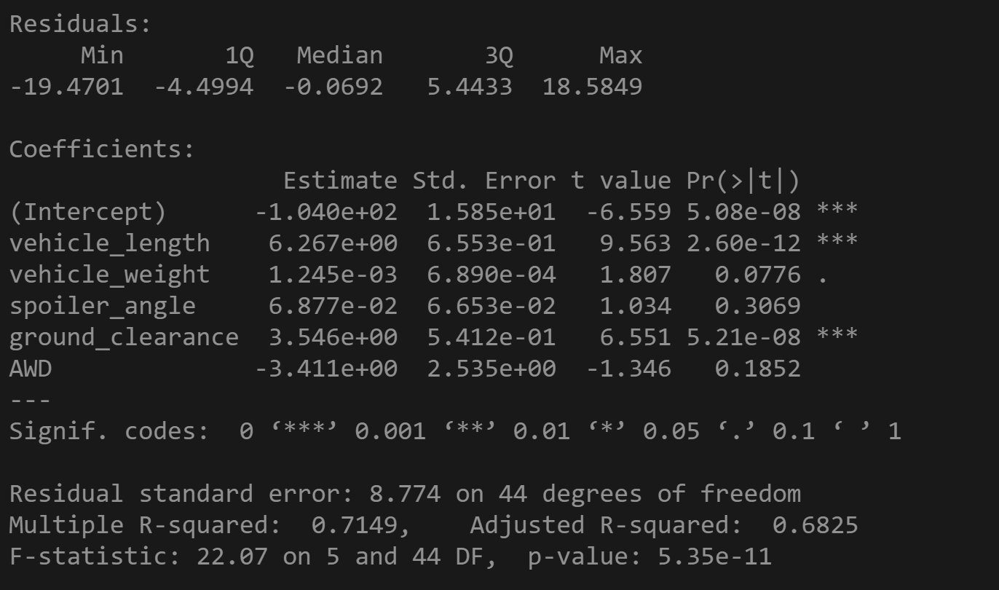
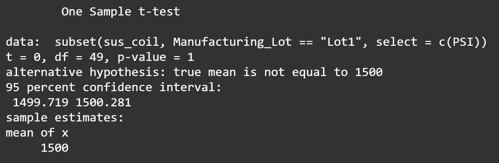
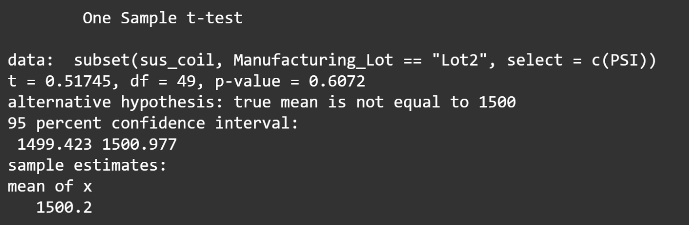
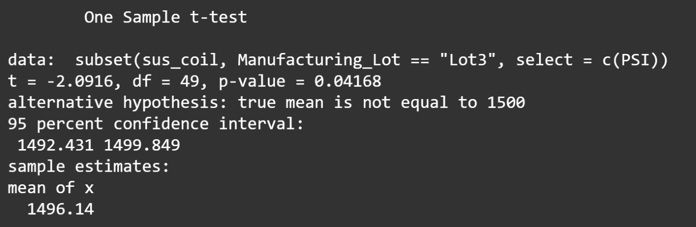
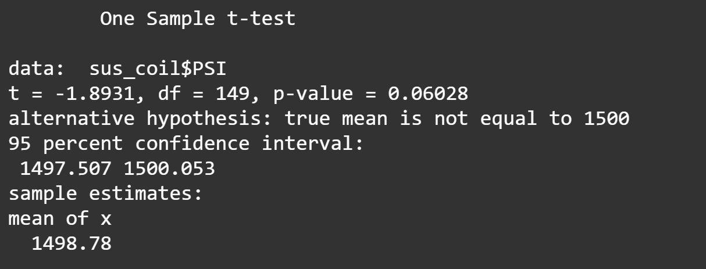

# MechaCar Statistical Analysis
## Linear Regression to Predict MPG

This multiple linear regression examines the influence five variables have on MPG (miles per gallon) for MechaCar prototypes.   
The Pr(>|t|) column lists the probability that each coefficient contributes a random amount of variance to the MPG values in the dataset. Given the significantly low probabilities of random contributions from Vehicle Length and Ground Clearance, there is statistical evidence that both variables have a regular impact on miles per gallon.   
However, with a significant intercept, the model leaves something to be desired, as it indicates further variability not explained by these parameters. So while two significant relationships were discovered and the null hypothesis can be rejected — now assuming a non-zero slope — three variables in the model had no impact, suggesting overfitting, and ~30% of the variance is still unexplained (based on R-squared), suggesting a good, yet incomplete model.
  

## Summary Statistics on Suspension Coils
### **Total PSI Summary Statistics**

 

### **PSI by Manufacturing Lot**

With design specifications dictating suspension coil variance be no greater than 100 pounds per square inch, the manufacturing data indicates that two of three lots are meeting this criteria. Lots One and Two are well below the maximum, as is the total variance for all three lots, but it could be much lower if Lot Three were not 70 pounds per square inch over the limit.   
Room for improvemnt in one lot, but so far so good everywhere else.
  

## T-Tests on Suspension Coils
### **Hypotheses**
_For all four tests._  
**α = 0.05**  
**H₀** - No statistical difference between the sample mean and the population mean.
**Ha** - There is a statistical difference between the sample mean and the population mean.   

### **Lot 1 vs. Pop. Mean PSI (1500 lbs/sq. inch)**

**p-value** - 1  
**Significance Level** - Not significant   
Lot 1 is perfect. Examining the entire sample, the average coil fails to deviate from our 1500 lbs/sq. inch metric. It matches the population mean exactly, resulting in a p-value of 1, and making Lot 1 perfectly average. Nothing noteworthy here.   

**Conclusion** - Fail to reject the null hypothesis.
  

### **Lot 2 vs. Pop. Mean (1500 lbs/sq. inch)**

**p-value** - 0.61  
**Significance Level** - Not significant   
Not as perfect as Lot 1, but still enough to support the null hypothesis. With a p-value of 0.61, Lot 2 slightly deviates from our hypothesized mean, but hardly enough to provide significant evidence for the alternative.
  

**Conclusion** - Fail to reject the null hypothesis.
  

### **Lot 3 vs. Pop. Mean (1500 lbs/sq. inch)**

**p-value** - 0.04  
**Significance Level** - Moderate   
At a p-value of 0.04, Lot 3 provides the only evidence for the alternative hypothesis. The moderately low probability of its results suggests its mean differs relatively significantly from the presumed population mean. We can see that this is true at the bottom of the image (mean of x: 1496.14). At a more precise significance level, this would be an issue, but at α = 0.05 we should just make note of it for now.
  

**Conclusion** - Reject the null hypothesis (at α = 0.05).
  

### **All Lots vs Pop. Mean (1500 lbs/sq. inch)**

**p-value** - 0.06  
**Significance Level** - Low   
Examining all three lots combined requires some context, which is why we examined them individually first. With a p-value of 0.06 and a mean of 1498.78, the result for all three lots barely clears our threshold of 0.05, and deviates from our hypothesis by only a hair. It is somewhat significant, but let's consider everything we just saw. Lots 1 and 2 are nearly perfect, with each sample mean falling right at the population mean. Lot 3 is a bit of an outlier, with its results being relatively unlikely under the null hypothesis, but still not strong evidence to reject it.   
The third lot clearly drags down the mean in this test, and it's reflected in the results, and a low significance level sounds about right for something caused by such an isolated issue. There is hardly enough evidence to refute the null hypothesis, so we fail to reject it.
  

**Conclusion** - Fail to reject the null hypothesis.
  

## Study Design: MechaCar vs. Competition
### **The Question**
Customers would likely be interested in a study that could show them where cost comes from for each vehicle. In other words, how do factors like fuel efficiency, safety rating, horse power, and year affect the cost of each vehicle?
  

### **Hypotheses**
_Significance Level_ 
**α = 0.05**  
**H₀** - Slope of linear model is zero, m = 0. 
**Ha** - Slope of linear model is not zero m ≠ 0. 
  

### **Design and Data**
I would run several multiple linear regressions for the MechaCar and for similar vehicles (probably three or four). Each regression would require data for each variable for each vehicle: 

_Dependent Variable_:
* Cost
 

_Independent Variables_:
* City/Highway Fuel Efficiency
* Safety Rating
* Year
  

After acquiring this data for each vehicle, I would run a separate regression for each car, determining the impact the parameters have on total cost.  
This would obviously require some tinkering, as it would be naïve to believe these three variables are responsible for the majority of the variance in cost among each type of vehicle tested. I would probably have to widen the list of independent variables and narrow down to the most impactful for each car. It would be time consuming to create, but very informative for consumers.
