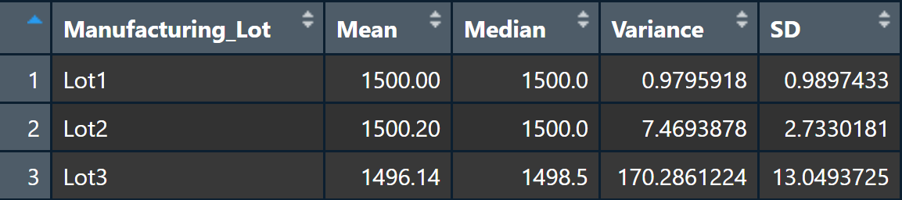

# MechaCar Statistical Analysis
## Linear Regression to Predict MPG

This multiple linear regression examines the influence five variables have on MPG (miles per gallon) for MechaCar prototypes.   
The Pr(>|t|) column lists the probability that each coefficient contributes a random amount of variance to the MPG values in the dataset. Given the significantly low probabilities of random contributions from Vehicle Length and Ground Clearance, there is statistical evidence that both variables have a regular impact on miles per gallon.   
However, with a significant intercept, the model leaves something to be desired, as it indicates further variability not explained by these parameters. So while two significant relationships were discovered and the null hypothesis can be rejected — now assuming a non-zero slope — three variables in the model had no impact, suggesting overfitting, and ~30% of the variance is still unexplained (based on R-squared), suggesting a good, yet incomplete model.
  

## Summary Statistics on Suspension Coils
### Total PSI Summary Statistics

 

### PSI by Manufacturing Lot

With design specifications dictating suspension coil variance be no greater than 100 pounds per square inch, the manufacturing data indicates that two of three lots are meeting this criteria. Lots One and Two are well below the maximum, as is the total variance for all three lots, but it could be much lower if Lot Three were not 70 pounds per square inch over the limit.   
Room for improvemnt in one lot, but so far so good everywhere else.